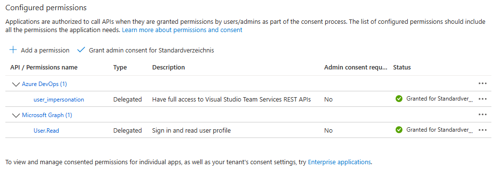
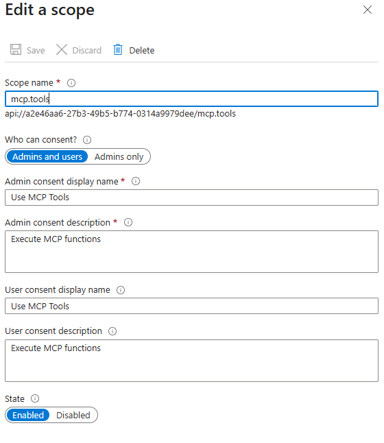

# MCP Server Azure DevOps Tool

[](LICENSE)
[](https://dotnet.microsoft.com/)

## Table of Contents

- [Overview](#overview)
- [Features](#features)
- [Project Structure](#project-structure)
- [Prerequisites](#prerequisites)
- [Installation](#installation)
- [Authentication & Permissions](#authentication--permissions)
- [Configuration](#configuration)
- [Usage](#usage)
- [Example Prompts](#example-prompts)
- [Contributing](#contributing)
- [License](#license)
- [Authors](#authors)
- [Security](#security)
- [Further Reading](#further-reading)
- [Support](#support)

---

## Overview

This project demonstrates how to create an MCP Server using the [MCP C# SDK](https://github.com/modelcontextprotocol/csharp-sdk) to manage Azure DevOps resources. It provides tools for listing projects, repositories, branches, and creating new branches via MCP server integration. All operations require authentication via Microsoft Entra ID, using the on-behalf-of flow for Azure DevOps.

For a full-featured MCP solution, check out the official MCP Azure DevOps server by Microsoft: https://github.com/microsoft/azure-devops-mcp

## Features

- List all Azure DevOps projects for an organization
- List all repositories for a project
- List all branches for a repository
- Create a new branch from an existing branch

## Project Structure

```
mcp-server-azure-devops/
├── .gitignore
├── CONTRIBUTING.md
├── LICENSE
├── nuget.config
├── README.md
├── .github/
│   └── workflows/
├── images/
│   ├── api-permissions.png
│   └── scope.png
└── src/
  ├── DevOpsMcp.sln
  ├── DevOpsMcp.Server/
	  ├── appsettings.json
	  ├── DevOpsMcp.Server.csproj
	  ├── DevOpsTokenHandler.cs
	  ├── Program.cs
	  ├── Settings.cs
	  ├── Properties/
	  │   └── launchSettings.json
	  ├── Services/
	  │   └── TokenService.cs
	  ├── Tools/
	  │   └── AzureDevOpsTool.cs
```

## Prerequisites

- Visual Studio or Visual Studio Code
- [.NET 9 SDK](https://dotnet.microsoft.com/download)
- Azure DevOps account with required permissions
- Microsoft Entra ID permissions to create App registrations

## Installation

1. Clone the repository:
   ```sh
   git clone https://github.com/heluxenhofer/mcp-server-azure-devops.git
   ```
2. Change to the project directory:
   ```sh
   cd .\src\DevOpsMcp.Server\
   ```
3. Restore and build the project:
   ```sh
   dotnet restore
   dotnet build
   ```
4. Run the project:
   ```sh
   dotnet run
   ```
   The MCP Server will start at `http://localhost:7071/`.

## Authentication & Permissions

### Azure DevOps

Ensure your Azure DevOps account has permissions for the actions you want to perform (e.g., listing projects, creating branches). Otherwise, you may receive unauthorized errors.

### Microsoft Entra ID App Registration

This MCP Server uses Microsoft Entra ID for authentication and authorization. You must create a new App Registration:

1. Sign in to the [Azure Portal](https://portal.azure.com/).
2. Create a new App Registration in your Entra ID tenant ([instructions](https://learn.microsoft.com/en-us/entra/identity-platform/quickstart-register-app)).
3. Add the redirect URI: `http://localhost:7071/callback`
4. Create a client secret ([instructions](https://learn.microsoft.com/en-us/entra/identity-platform/how-to-add-credentials?tabs=client-secret)).
5. Add API permissions as shown below:

   
6. Expose an API and create the scope `mcp.tools`:

   

## Configuration

Update `appsettings.json` (or use user secrets) with your Azure AD settings:

```json
{
  "AzureAd": {
	"ClientId": "",
	"ClientSecret": "",
	"TenantId": ""
  }
}
```

## Usage

### MCP Server Tool: `AzureDevOpsTool`

Main methods:

- `ListProjects(orgName)`
- `ListRepositories(orgName, projectName)`
- `ListBranches(orgName, projectName, repositoryName)`
- `CreateBranch(server, orgName, projectName, repositoryName, newBranchName, cancellationToken)`

#### Example VS Code Integration

Example `mcp.json` configuration ([docs](https://code.visualstudio.com/docs/copilot/chat/mcp-servers)):

```json
{
  "servers": {
	"daenet-devops-mcp": {
	  "type": "http",
	  "dev": {},
	  "url": "http://localhost:7071",
	  "args": [
		"${input:ado_org}"
	  ]
	}
  },
  "inputs": [
	{
	  "id": "ado_org",
	  "type": "promptString",
	  "description": "Azure DevOps organization name (e.g. 'contoso')",
	  "password": false
	}
  ]
}
```

## Example Prompts

```
List all my Azure DevOps projects in organization <your Azure DevOps org name>
Give me details about project <Azure DevOps project name>
List all repositories for project <Azure DevOps project name>
Create new branch 'test' in repository <Azure DevOps repository name>
```

When creating a new branch, the tool will prompt you to select the source branch.

## Contributing

Contributions are welcome! Please read [CONTRIBUTING.md](CONTRIBUTING.md) before submitting pull requests.

## License

This project is licensed under the [MIT License](LICENSE).

## Authors

- Heiko Luxenhofer ([LinkedIn](https://de.linkedin.com/in/heiko-luxenhofer-169064265))

## Security

Please report security issues via GitHub Issues or directly to the maintainers.

## Further Reading

- [Azure DevOps REST API Documentation](https://learn.microsoft.com/en-us/rest/api/azure/devops/)
- [MCP C# SDK](https://github.com/modelcontextprotocol/csharp-sdk)
- [Microsoft Entra ID App Registration](https://learn.microsoft.com/en-us/entra/identity-platform/quickstart-register-app) 

## Support

For support, please open an issue on GitHub or contact the maintainers directly.
