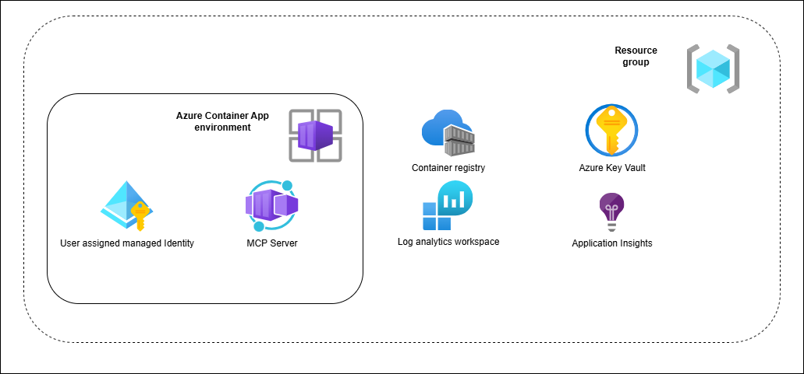

# MCP Server Azure DevOps Tool

[](LICENSE)
[](https://dotnet.microsoft.com/)

## Table of Contents

- [Overview](#overview)
- [Features](#features)
- [Monitoring](#monitoring)
- [Prerequisites](#prerequisites)
- [Installation](#installation)
- [Deploying to Azure with Azure Development CLI](#deploying-to-azure-with-azure-development-cli-azd)
- [Authentication & Permissions](#authentication--permissions)
- [Configuration](#configuration)
- [Usage](#usage)
- [Example Prompts](#example-prompts)
- [Contributing](#contributing)
- [License](#license)
- [Authors](#authors)
- [Security](#security)
- [Further Reading](#further-reading)
- [Support](#support)

---

## Overview

This project demonstrates how to create an MCP Server using the [MCP C# SDK](https://github.com/modelcontextprotocol/csharp-sdk) to manage Azure DevOps resources. It provides tools for listing projects, repositories, branches, and creating new branches via MCP server integration. All operations require authentication via Microsoft Entra ID, using the on-behalf-of flow for Azure DevOps.

## Showcase Video

**[▶ Watch the showcase video (MP4, 2 min)](docs/videos/showcase.mp4)**

## Official Microsoft Azure DevOps MCP Solution

For a full-featured MCP solution, check out the official MCP Azure DevOps server by Microsoft: <https://github.com/microsoft/azure-devops-mcp>

## Features

- List all Azure DevOps projects for an organization
- List all repositories for a project
- List all branches for a repository
- Create a new branch from an existing branch

## Monitoring

This project uses cloud-native monitoring and logging to ensure reliability and observability.
Monitoring and logging are handled via the .NET `ILogger` interface throughout the application.
When deployed to Azure, all logs and telemetry are automatically sent to Application Insights, enabling diagnostics and performance tracking without extra configuration.
For local development, logs are output to the console for easy debugging.
No custom monitoring endpoints are exposed; all monitoring is managed through Application Insights in the cloud.

## Prerequisites

- Visual Studio or Visual Studio Code
- [.NET 9 SDK](https://dotnet.microsoft.com/download)
- Azure DevOps account with required permissions
- Microsoft Entra ID permissions to create App registrations

## Installation

1. Clone the repository:

   ```sh
   git clone https://github.com/heluxenhofer/mcp-server-azure-devops.git
   ```

2. Change to the project directory:

   ```sh
   cd .\src\DevOpsMcp.Server\
   ```

3. Restore and build the project:

   ```sh
   dotnet restore
   dotnet build
   ```

4. Run the project:

  ```sh
  dotnet run
  ```

  The MCP Server will start at `http://localhost:7071/`.

## Deploying to Azure with Azure Development CLI (azd)

### Required Environment Variables

Before deploying the application with `azd`, you must set the following environment variables for Microsoft Entra ID authentication:

- `AZUREAD_CLIENTID`: The Application (client) ID of your Entra ID app registration
- `AZUREAD_CLIENTSECRET`: The client secret for your Entra ID app registration
- `AZUREAD_TENANTID`: The Directory (tenant) ID of your Entra ID

These variables must be set before running `azd provision` or `azd deploy` and after `azd init`, as they are required for the application to authenticate with Microsoft Entra ID. You can set them in the `.env` file for your environment (e.g., `.azure/<environment>/.env`).
All other environment variables (such as resource group, region, container app name, etc.) are automatically set and managed by `azd` during provisioning and deployment.

You can deploy this MCP Server to Azure using the [Azure Developer CLI (azd)](https://learn.microsoft.com/en-us/azure/developer/azure-developer-cli/overview). This enables automated provisioning of infrastructure and application deployment using the Bicep files in the `infra/` directory.

### Setting the MCP Resource FQDN with `set-env-vars.ps1`

After deployment, the `set-env-vars.ps1` PowerShell script is executed as a `postdeploy` hook, as specified in `azure.yaml`:

```yaml
hooks:
  postdeploy:
    shell: pwsh
    run: ./set-env-vars.ps1
```

**What this does:**

- The script runs after the app and resources are deployed.
- It uses environment variables that are set from the outputs of the Bicep deployment (such as the Container App FQDN and resource group name). These outputs are automatically exported by `azd` and made available to the script after provisioning.
- It sets the `MCP_RESOURCE_FQDN` environment variable in the Azure Container App, using the fully qualified domain name (FQDN) provisioned in Azure.
- This environment variable is used by the application to construct its public resource metadata URL.

**You can further customize `set-env-vars.ps1` if your application needs to set additional environment variables or use other Bicep outputs.**

### Prerequisites

- Azure subscription and account with sufficient permissions
- [Azure Developer CLI (azd)](https://learn.microsoft.com/en-us/azure/developer/azure-developer-cli/install-azd) installed
- [.NET 9 SDK](https://dotnet.microsoft.com/download)

### Steps

1. **Login to Azure**

  ```sh
  azd auth login
  ```

2. **Initialize the environment**

  ```sh
  azd init
  ```

  Follow the prompts to select the environment name and Azure location.

3. **Provision Azure resources**

  ```sh
  azd provision
  ```

  This will deploy all resources defined in `infra/` using Bicep.

4. **Deploy the application**

  ```sh
  azd deploy
  ```

  This will build and deploy the MCP Server to the provisioned Azure resources.

5. **View the deployed app**
  After deployment, azd will output the endpoint URL. You can access your MCP Server at this address.

### Infrastructure as Code

All Azure resources are defined in the `infra/` directory using Bicep. You can customize these files to fit your requirements.


 

Azure Resources Deployed (from `infra/main.bicep`)
- **Resource Group**: Logical container for all resources.
- **Azure Container App Environment**: Provides the hosting environment for one or more container apps
- **Azure Container App**: Hosts the MCP Server application as a scalable containerized service within the Container App Environment.
- **Azure Managed Identity**: Provides secure identity for the app to access Azure resources without secrets.
- **Azure Container Registry**: The Azure Container Registry (ACR) is a managed Docker registry service used to store and manage container images.
- **Log Analytics Workspace**: Collects and analyzes logs from the Container App for monitoring and diagnostics.
- **Application Insights**: Provides monitoring and observability for the MCP Server application. All logs and telemetry from the application are sent via the .NET `ILogger` interface to Application Insights when running in Azure. Application Insights collects telemetry data such as requests, dependencies, exceptions, and performance metrics, enabling you to analyze usage, diagnose issues, and ensure the health of the deployed service.
- **Azure Key Vault**: Stores secrets and sensitive configuration securely.

See `infra/main.bicep` and `infra/resources.bicep` for the full list and configuration of deployed resources. |

### Troubleshooting & Documentation

- [azd documentation](https://learn.microsoft.com/en-us/azure/developer/azure-developer-cli/)
- [Bicep documentation](https://learn.microsoft.com/en-us/azure/azure-resource-manager/bicep/)

If you encounter issues, check the azd output for error messages or consult the official documentation above.

## Authentication & Permissions

### Azure DevOps

Ensure your Azure DevOps account has permissions for the actions you want to perform (e.g., listing projects, creating branches). Otherwise, you may receive unauthorized errors.

### Microsoft Entra ID App Registration

This MCP Server uses Microsoft Entra ID for authentication and authorization. You must create a new App Registration:

1. Sign in to the [Azure Portal](https://portal.azure.com/).
2. Create a new App Registration in your Entra ID tenant ([instructions](https://learn.microsoft.com/en-us/entra/identity-platform/quickstart-register-app)).
3. Add the redirect URI: `http://localhost:7071/callback` for local development or public Url of your container app
4. Create a client secret ([instructions](https://learn.microsoft.com/en-us/entra/identity-platform/how-to-add-credentials?tabs=client-secret)).
5. Add API permissions as shown below:

   
6. Expose an API and create the scope `mcp.tools`:

   

## Configuration

Update `appsettings.json` (or use user secrets) with your Azure AD settings on local development:

```json
{
  "AzureAd": {
 "ClientId": "",
 "ClientSecret": "",
 "TenantId": ""
  }
}
```
For deployment to Azure reference [Deployment section](#deploying-to-azure-with-azure-development-cli-azd)

## Usage

### MCP Server Tool: `AzureDevOpsTool`

Main methods:

- `ListProjects(orgName)`
- `ListRepositories(orgName, projectName)`
- `ListBranches(orgName, projectName, repositoryName)`
- `CreateBranch(server, orgName, projectName, repositoryName, newBranchName, cancellationToken)`

#### Example VS Code Integration

Example `mcp.json` configuration ([docs](https://code.visualstudio.com/docs/copilot/chat/mcp-servers)):

```json
{
  "servers": {
 "daenet-devops-mcp": {
   "type": "http",
   "dev": {},
   "url": "http://localhost:7071",
   "args": [
  "${input:ado_org}"
   ]
 }
  },
  "inputs": [
 {
   "id": "ado_org",
   "type": "promptString",
   "description": "Azure DevOps organization name (e.g. 'contoso')",
   "password": false
 }
  ]
}
```
***Note: For using deployed MCP Server in Azure, reference Container App public url.***

## Example Prompts

```
List all my Azure DevOps projects in organization <your Azure DevOps org name>
Give me details about project <Azure DevOps project name>
List all repositories for project <Azure DevOps project name>
Create new branch 'test' in repository <Azure DevOps repository name>
```

When creating a new branch, the tool will prompt you to select the source branch.

## Contributing

Contributions are welcome! Please read [CONTRIBUTING.md](CONTRIBUTING.md) before submitting pull requests.

## License

This project is licensed under the [MIT License](LICENSE).

## Authors

- Heiko Luxenhofer ([LinkedIn](https://de.linkedin.com/in/heiko-luxenhofer-169064265))

## Security

Please report security issues via GitHub Issues or directly to the maintainers.

## Further Reading

- [Azure DevOps REST API Documentation](https://learn.microsoft.com/en-us/rest/api/azure/devops/)
- [MCP C# SDK](https://github.com/modelcontextprotocol/csharp-sdk)
- [Microsoft Entra ID App Registration](https://learn.microsoft.com/en-us/entra/identity-platform/quickstart-register-app)

## Support

For support, please open an issue on GitHub or contact the maintainers directly.
